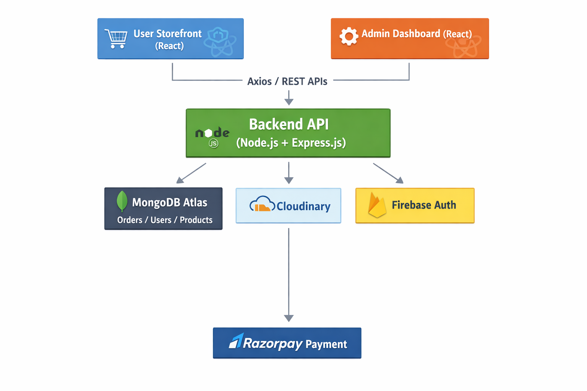

# Fullstack E-Commerce

A full-stack e-commerce application with two frontend interfaces:

- **Admin Panel** for sellers/owners to manage products and inventory
- **User Storefront** where customers can browse and purchase products

---

## 📌 Project Overview

This is an **individual learning project** built to gain hands-on experience with the **MERN stack** by developing a real-world e-commerce application.

The project focuses on implementing practical features such as **product management**, **inventory handling**, **authentication**, and **secure payment flow**, while experimenting with modern tools like **Tailwind CSS**, **Swiper Slider**, and various **NPM packages**.

It also includes real-world concepts such as **Firebase authentication**, **role-based access control**, and scalable **frontend–backend integration**.

---

## 📁 Project Structure

full-stack_e-comm/
│
├── admin/ → Seller/Admin dashboard (React)
├── front-end/ → User storefront (React)
└── back-end/ → REST API (Node.js + Express + MongoDB)

This repository is organized into three main modules, each responsible for a specific part of the application:

- **admin/**  
  Admin dashboard built with React for **sellers/owners** to manage products, categories, inventory, and orders.

- **front-end/**  
  User-facing storefront built with React where **buyers/customers** can browse products, search, add items to cart, and place orders.

- **back-end/**  
  Backend REST API built using **Node.js, Express.js, and MongoDB**, handling authentication, business logic, database operations, and integrations.

## 🚀 Features

### 🔐 Authentication & Authorization

- User signup and login
- Firebase authentication integration
- Role-based access control (Admin & User)

### 📦 Product & Inventory Management

- Product CRUD operations (Add / Edit / Delete)
- Category and subcategory management
- Inventory and stock tracking

### 🛒 E-Commerce Flow

- Shopping cart functionality
- Checkout process
- Razorpay payment gateway integration

### 📊 Admin Dashboard

- Admin analytics dashboard
- User management (view, block, delete users)

### ⚙️ General Features

- Image upload using Cloudinary
- Search, filter, and pagination
- Responsive UI for mobile, tablet, and desktop

## 🛠 Tech Stack

### Frontend (Admin & User)

- React
- Tailwind CSS
- Context API (State Management)
- Swiper Slider

### Backend

- Node.js
- Express.js
- MongoDB Atlas
- Mongoose

### Authentication & Services

- Firebase Authentication
- Razorpay (Test Mode)
- Cloudinary (Image Storage)

## ⚙️ Setup & Run Locally

### Prerequisites

- Node.js (Latest LTS recommended)
- npm package manager
- MongoDB Atlas account
- Firebase project
- Cloudinary account
- Razorpay account (Test Mode)

### 1️⃣ Clone the Repository

```bash
git clone https://github.com/SurajPatil29/full-stack_e-comm
cd full-stack_e-comm

cd back-end
npm install
npm run dev

cd front-end
npm install
npm run dev

cd admin
npm install
npm run dev
```

## 🌍 Environment Variables

Create a `.env` file in each module and add the following variables.

### 🔧 Backend (`back-end/.env`)

```env
PORT=8000
MONGODB_URL=your_mongodb_connection_string

EMAIL=your_email_for_nodemailer
EMAIL_PASS=your_email_password

JSON_WEB_TOKEN_SECRET_KEY=your_jwt_secret
SECRET_KEY_ACCESS_TOKEN=your_access_token_secret
SECRET_KEY_REFRESH_TOKEN=your_refresh_token_secret

cloudinary_Config_Cloud_Name=your_cloudinary_cloud_name
cloudinary_Config_api_key=your_cloudinary_api_key
```

### 🔧 Admin frontend (`admin/.env`)

```env
VITE_API_URL=http://localhost:8000

VITE_FIREBASE_APP_API_KEY=your_key
VITE_FIREBASE_APP_AUTH_DOMAIN=your_domain
VITE_FIREBASE_APP_PROJECT_ID=your_project_id
VITE_FIREBASE_APP_STORAGE_BUCKET=your_bucket
VITE_FIREBASE_APP_MESSAGING_SENDER_ID=your_sender_id
VITE_FIREBASE_APP_APP_ID=your_app_id
VITE_FIREBASE_APP_MEASUREMENT_ID=your_measurement_id
```

### 🔧 Clint frontend (`front-end/.env`)

```env
VITE_API_URL=http://localhost:8000

VITE_FIREBASE_APP_API_KEY=your_key
VITE_FIREBASE_APP_AUTH_DOMAIN=your_domain
VITE_FIREBASE_APP_PROJECT_ID=your_project_id
VITE_FIREBASE_APP_STORAGE_BUCKET=your_bucket
VITE_FIREBASE_APP_MESSAGING_SENDER_ID=your_sender_id
VITE_FIREBASE_APP_APP_ID=your_app_id
VITE_FIREBASE_APP_MEASUREMENT_ID=your_measurement_id

VITE_APP_RAZORPAY_KEY_ID=your_razorpay_key
VITE_APP_RAZORPAY_KEY_SECRET=your_razorpay_secret
```

## 📂 ScreenShots

### 🏠 User Storefront


### 🛒 Product Listing


### Product Details


### Cart Page


### Checkout Page


### 💳 Payment Gateway


### 🧑‍💼 Admin Dashboard


### Product Management


## 📂 Module Documentation

- 📘 [Backend API Documentation](./back_end/README.md)
- 🛍 [Frontend Application](./front_end/README.md)
- 🧑‍💼 [Admin Dashboard](./admin/README.md)

## 👨‍💻 Author

Suraj Patil
Full-Stack MERN Developer

## 🏗 Architecture Diagram

The following diagram illustrates the high-level architecture of the Fullstack E-Commerce application, showing how the frontend, backend, database, and third-party services interact.

### Pie Diagram Management


