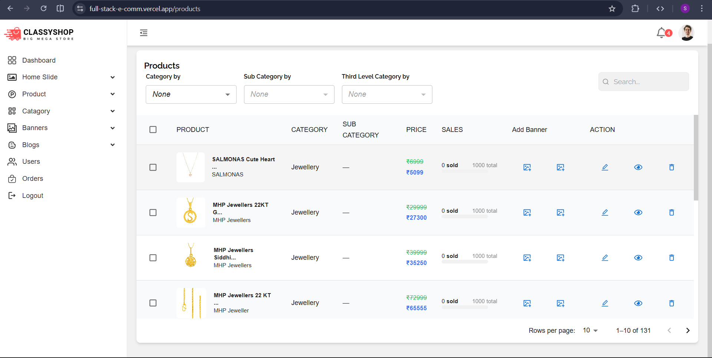

# Admin Dashboard – Fullstack E-Commerce

This is the **Admin Dashboard** of the Fullstack E-Commerce application, designed for **Sellers and Owners** to manage the entire platform efficiently.

The dashboard allows admins to manage **products, categories, inventory, users, and orders**, and to monitor overall store activity through analytics.  
It is built with **React** and designed to be **responsive**, providing a smooth experience across desktop and tablet devices.

## 🛠 Admin Tech Stack

### Core

- React (v19)
- Vite (Build & Development Tool)
- React Router DOM (Routing)

### Styling & UI

- Tailwind CSS
- Material UI (MUI)
- Emotion (CSS-in-JS)
- React Icons

### State Management

- React Context API

### API & Authentication

- Axios (API communication)
- Firebase Authentication

### Data Visualization

- Recharts (Admin analytics & charts)

### UI & UX Enhancements

- Swiper Slider
- React Hot Toast (Notifications)
- Lazy Loading Images
- Inner Image Zoom
- Collapse Animations
- WYSIWYG Editor (Rich text content)
- International Phone Input

## 🚀 Features

### 📦 Product & Inventory Management

- Add new products
- Edit existing products
- Delete products
- Manage product stock and inventory

### 🗂 Category & Content Management

- Category and subcategory management
- Homepage banner management
- Blog and rich content management

### 📦 Orders & Users

- View all orders
- Update order status
- User management (view, block, delete users)

### 📊 Dashboard & Analytics

- Sales analytics and charts
- Product and order statistics

## 🧭 Pages & Admin Flow

The Admin Dashboard is structured to allow sellers and owners to manage the platform efficiently:

- **Dashboard** – Overview of sales, orders, and analytics
- **Product Management** – Add, edit, delete products
- **Category Management** – Manage categories and subcategories
- **Banner Management** – Control homepage banners and promotions
- **Order Management** – View and update order statuses
- **User Management** – Manage registered users
- **Blog Management** – Create and manage blog/content pages

## 🌍 Environment Variables

Create a `.env` file in the `admin` directory with the following variables:

````env
VITE_API_URL=http://localhost:8000

VITE_FIREBASE_APP_API_KEY=your_key
VITE_FIREBASE_APP_AUTH_DOMAIN=your_domain
VITE_FIREBASE_APP_PROJECT_ID=your_project_id
VITE_FIREBASE_APP_STORAGE_BUCKET=your_bucket
VITE_FIREBASE_APP_MESSAGING_SENDER_ID=your_sender_id
VITE_FIREBASE_APP_APP_ID=your_app_id
VITE_FIREBASE_APP_MEASUREMENT_ID=your_measurement_id
````
## ▶️ Run Admin Locally

### Prerequisites
- Node.js (Latest LTS recommended)
- npm package manager
- Backend server running on `http://localhost:8000`

### Steps
```bash
cd admin
npm install
npm run dev
```
## 📸 Screenshots

### 📊 Dashboard Analytics


### 📦 Product Management


